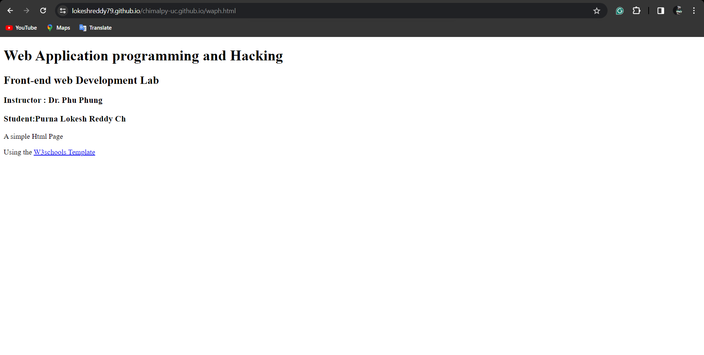
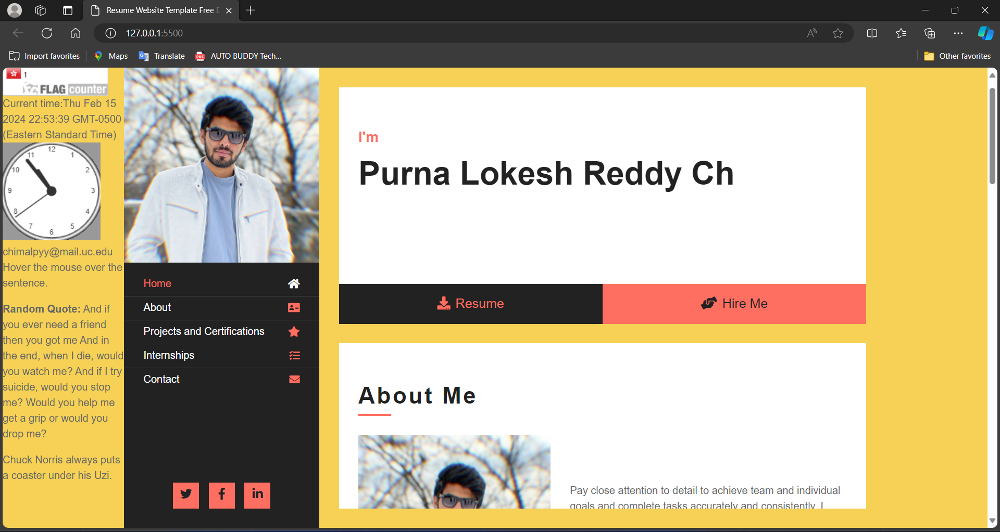
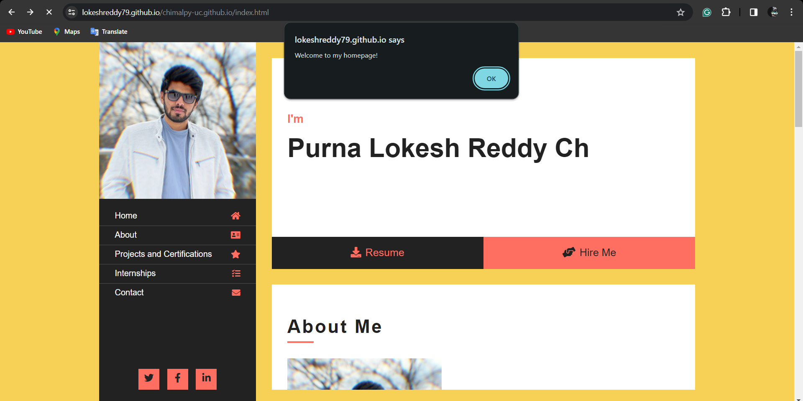

# WAPH-Web Application Programming and Hacking

## Instructor: Dr. Phu Phung

## Student

**Name**: Purna Lokesh Reddy Chimalamarri

**Email**: chimalpy@mail.uc.edu

**Short-bio**: lokeshreddy79 has keen interests in Web software development and watching movies.. 

github link= [link to my github](https://github.com/lokeshreddy79/chimalpy-uc.github.io)

### INDIVIDUAL PROJECT -1 :

Personal Website Creation (25 pts)
- Created a professional profile website hosted on GitHub Pages under my username repository. 

- Included name, headshot image, contact info, background, education, experiences, and skills on the homepage.

- Used HTML, CSS, and Bootstrap framework to structure content and design responsive layout.

- Customized the site to showcase my abilities and target potential employers.

Course Introduction Page (5 pts)  
- Added a new HTML page linked from the homepage to introduce the "Web Application Programming and Hacking" course.

- Provided an overview of the course topics, labs, hackathons, and hands-on projects. 

- Listed the key concepts, technologies, and skills covered in the course.

- Designed the page content and layout to give visitors insight into the course.

Here are the key points on how I implemented the JavaScript requirements:

Basic JavaScript Code (20 pts)

- Used jQuery library for DOM manipulation and events.

- Added Moment.js library to display dynamic digital and analog clocks. 

- Implemented show/hide email functionality using jQuery to toggle email visibility.

- Built a random quote generator using JavaScript and the Quotable API.

- Added smooth scrolling when clicking navigation links using ScrollReveal.js.
-  I incorporated the Bootstrap CSS framework into my website for responsive design and theming support.

- I used Bootstrap's grid system and UI components like buttons, navbar, cards etc to quickly build the layout and components.

- I leveraged Bootstrap's utility classes for typography, colors, spacing, sizing to style elements without writing custom CSS.

- I chose a free open source Bootstrap theme from Bootswatch and integrated it via CDN for visual styling and pre-defined CSS.

- The theme provides consistent styling for all elements like headers, paragraphs, lists, forms etc out of the box.

- Using Bootstrap allowed me to build a responsive site that automatically adapts layout across all devices with minimal effort. 

Web APIs Integration (20 pts)

- For quotes, I integrated the Quotable API to display random famous quotes.

- For jokes, I used the Chuck Norris Jokes API to show random Chuck Norris jokes. 

- The Quotable API returns quote JSON data that I parsed to display the quote text and author.

- The Chuck Norris API returns joke strings that I directly inserted into the page.

- I made asynchronous fetch calls to both APIs and handled loading states.

- New quotes and jokes are generated every 60 seconds automatically.

- Used JavaScript to check if a cookie named 'lastVisit' exists when the page loads.

-If the cookie doesn't exist, it means this is the first visit, so I:

-Displayed a "Welcome to my homepage!" message using alert().
-Created a new 'lastVisit' cookie using document.cookie, with the current date/time as the value.
-If the cookie already exists, it means the user has visited before, so I:

-Parsed the cookie value to extract the last visit date/time.
-Displayed a "Welcome back! Your last visit was [last visit date/time]" message.
-Updated the 'lastVisit' cookie value to the current date/time.
-The 'lastVisit' cookie persists thanks to the expires property and stores the last visit info client-side.

.png)

